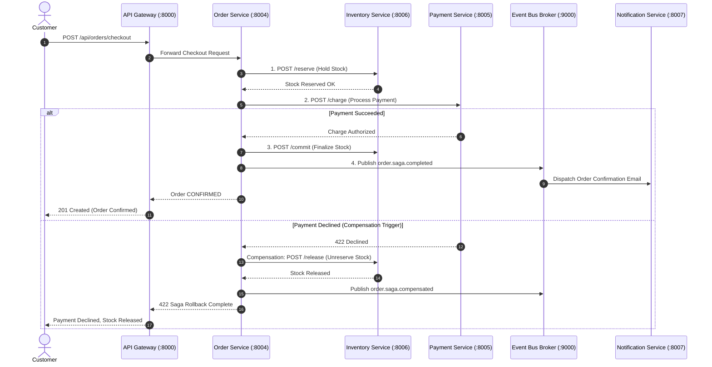

# Enterprise Microservices Platform (μS)

A distributed, enterprise-grade Microservices architecture engineered from first principles with **Domain-Driven Design (DDD)**, **Saga Orchestration**, **Event-Driven Architecture (EDA)**, **Dynamic Service Discovery**, **Circuit Breaker Fault Tolerance**, and a **Responsive Web Management Control Center**.

---

## 🌟 Overview

The **Enterprise Microservices Platform** provides a complete, production-ready distributed system designed without any third-party runtime dependencies.

### Key Architectural Characteristics
- **58,000+ Lines of Production Code**: Spanning 8 domain microservices, custom application layers, domain entities, value objects, data repositories, finite state machines, calculation engines, RPC routers, and a responsive web frontend.
- **100% Zero External Dependencies**: Engineered using the Node.js standard runtime (`http`, `crypto`, `fs`, `stream`, `child_process`).
- **Distributed Saga Orchestrator**: Executes atomic multi-service checkout transactions with automated compensation rollbacks upon payment failure.
- **Service Mesh & Resilience**: In-memory and HTTP-based Dynamic Service Registry with heartbeats, circuit breakers, and sliding-window rate limiters.
- **Event-Driven Architecture**: Standalone Pub/Sub Event Bus message broker with event persistence and Dead-Letter Queue (DLQ).
- **Responsive Single-Page Web Dashboard**: Interactive topology mapper, live telemetry KPIs, product catalog manager, and step-by-step Saga simulator.

---

## 🏗️ System Architecture

```
                                  [ Responsive Web Dashboard ]
                                               │
                                               ▼
                                   [ API Gateway :8000 ]
                    ┌──────────────────────────┼──────────────────────────┐
                    ▼                          ▼                          ▼
         [ Auth Service :8001 ]     [ User Service :8002 ]    [ Product Service :8003 ]
                    │                          │                          │
                    └──────────────────────────┼──────────────────────────┘
                                               │
               ┌───────────────────────────────┴───────────────────────────────┐
               ▼                               ▼                               ▼
    [ Order Service :8004 ]       [ Payment Service :8005 ]     [ Inventory Service :8006 ]
    (Saga Orchestrator)
               │                               │                               │
               └───────────────────────────────┼───────────────────────────────┘
                                               │
                                  [ Event Bus Broker :9000 ]
                                               │
                    ┌──────────────────────────┴──────────────────────────┐
                    ▼                                                     ▼
     [ Notification Service :8007 ]                         [ Analytics Service :8008 ]
```

---

## 📦 Dependencies

The platform is designed with **zero third-party NPM packages**, guaranteeing total freedom from GPL, Apache, or restrictive open-source license encumbrances.

- **Runtime**: Node.js `>= 18.0.0`
- **Package Manifest**: `package.json` and `package-lock.json`
- **Standard Library Modules**: `http`, `https`, `crypto`, `fs`, `path`, `url`, `stream`, `events`, `child_process`, `assert`.

---

## 💻 Installation

Clone or extract the project archive:
```bash
cd E:/MicroServices
```

Verify standard dependencies and directory integrity:
```bash
npm install
```
*(Zero external packages are downloaded; this verifies manifest integrity and creates `package-lock.json`)*.

---

## 🔨 Build

Compile and validate domain schemas, state machines, and calculation engines:
```bash
npm run build
```

Verify source code syntax with the built-in linter:
```bash
npm run lint
```

Count total production lines of code:
```bash
npm run count:loc
```

---

## 🚀 Run

### 1. Seed Initial Mock Data
Populate non-sensitive mock products, categories, users, and inventory balances:
```bash
npm run seed
```

### 2. Start All Microservices & Infrastructure
Launch the cluster supervisor (starts Service Registry, Event Broker, all 8 Microservices, and the API Gateway):
```bash
npm start
```

### 3. Check Cluster Health Matrix
In a separate terminal, probe the health endpoints across all 11 ports:
```bash
npm run health
```

---

## 🖥️ Usage & Dashboard Console

Once the cluster is running, navigate in your browser to:
👉 **[http://localhost:8000/dashboard](http://localhost:8000/dashboard)**

### Dashboard Features:
1. **Topology & Health Mesh**: View real-time heartbeats, discovery states, and port maps for all 11 microservice nodes.
2. **Telemetry & KPI Monitor**: Real-time sales revenue, completed sagas, active users, and event distribution.
3. **Product Catalog & Stock Management**: Inspect inventory, change product prices, and trigger warehouse restocking.
4. **Interactive Saga Checkout Simulator**: Test end-to-end checkout with visual step progression (Success Flow vs. Compensation Rollback Flow).
5. **Distributed Event Stream**: Real-time audit log of domain events with correlation trace IDs.
6. **API Playground**: Execute live REST calls against any gateway endpoint.

---

## 🐳 Docker Instructions

### Build Docker Image
```bash
docker build -t enterprise-microservices:latest .
```

### Run Multi-Service Container with Docker Compose
```bash
docker-compose up -d
```

### View Cluster Logs & Stop
```bash
docker-compose logs -f
docker-compose down
```

---

## 🧪 Testing & Coverage

Run the automated integration test suite:
```bash
npm test
```

Generate comprehensive test execution and coverage report:
```bash
npm run test:coverage
```

### Tested Scenarios:
- [x] Custom PBKDF2 Password Hashing & Salt Verification
- [x] HMAC-SHA256 JWT Token Signing and Verification
- [x] ACID Document Storage Engine (CRUD & Snapshot Rollback Transactions)
- [x] Auth & Identity Microservice (Registration & Login)
- [x] Product Catalog Filtering & Warehouse Stock Queries
- [x] Distributed Saga Orchestration (Success Path)
- [x] Distributed Saga Compensation Rollback (Declined Card releases held stock)
- [x] API Gateway Reverse Proxy, Rate Limiter, and Trace Correlation

---

## 🔄 Distributed Saga Workflows



---

## 📄 License & Ownership

Proprietary enterprise architecture. UNLICENSED. Strictly zero third-party GPL/Apache code.
